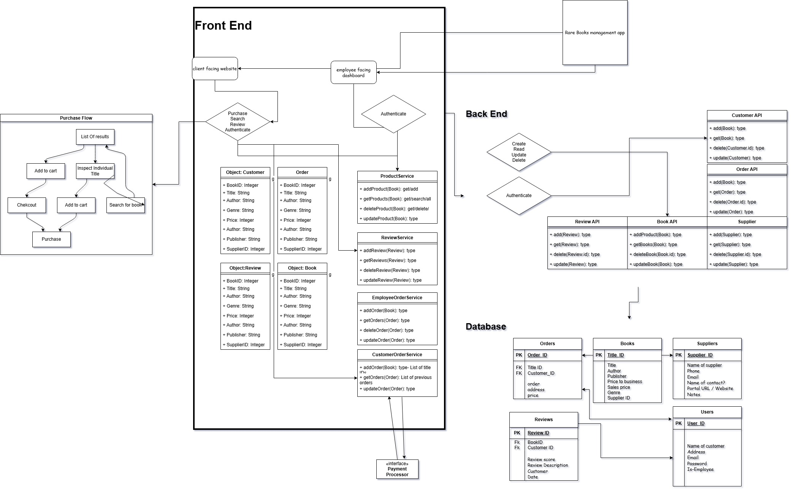

# BookStore app #

# Tech Stack #

### Front End ###
**nodejs** 

Vue/Primevue/pinia -- Frontend frameworks with state management

Vite -- Server 

### Back End ###

Python based


FastAPI -- Provides fast and easy to use openAPI based library

SQLAlchemy -- Library used to interact with database

mariaDB -- Relational database

Faker -- Generating usable fake data to put in database


# Frontend Setup
clone repo 

navigate to frontend folder
```

npm install
```
```

npm run dev
```

# Backend setup #

navigate to backend folder and set virtual enviroment
```
pip install -r  requirements.txt
```


 ## Windows build ##
 
install mariaDB msi file from https://mariadb.com/downloads/

default settings: easy root password you'll remember. not open to remote users. Its going to install a heidiSQL client, we'll use that later as a gui to import the shema. 

instructions are based on using VS code, with the built in powershell console. commands might be able to be entered elsewhere. 

install python 3.12 from windows store 
create project folder on desktop

setup python virtual enviroment  --- more info https://docs.python.org/3/library/venv.html

```
Python -m venv C:\Users\{yourusername}\Desktop\Bookstore
```

place files in "app" folder in the same directory used above
```
C:\Users\{you}\Desktop\Bookstore

```

```
.\Scripts\Activate
```
if error, this will be needed. May be turn it off later. 
```
Set-ExecutionPolicy -ExecutionPolicy RemoteSigned -Scope CurrentUser 
```
now virtual enviroment is active. may have tag. 
upgrade pip
```
.\Scripts\python.exe -m pip install --upgrade pip  --
```

install all of the things

```
pip install -r requirements.txt
```


https://mariadb.com/downloads/


## setup database. ##


open heidisql , connect to database with root user and password entered into setup for mariadb

file>runSql > Shema.sql

press f5, should be a database named bookstore now. 

in code, can go into project folder, if we run the genData.py itll fill the database with records. i like to press the little play button. 

uvicorn backend:app

in python virtual enviroment will open webpage. should see :
INFO:     Started server process [7796]
INFO:     Waiting for application startup.
INFO:     Application startup complete.
INFO:     Uvicorn running on http://127.0.0.1:8000 (Press CTRL+C to quit)

From here navigate to :
```
http://127.0.0.1:8000/docs
```

Here are interactive docs. As of now some endpoints are broken, like authentication, but orders, books, users, all should work. 


## Build virtual machine from "scratch" on virtualbox ##


https://www.virtualbox.org/

install debain using an ISO from debians website.
https://www.debian.org/download
12.5 bookworm amd64


install using ISO by creating a new machine. Settings i chose were 30gb disk, 4 cores, and 4196 of RAM. . i like to make sure guest additions are available for drag and drop and other conviences. 

make sure unattended install is unchecked
Installing may take a few minutes. 

once inside of debian, 

Create project folder on desktop

```
mkdir project

```
Debian is kinda wierd IMO, no sudo by defailt, you can switch to root user and just omit sudo commands, or add yourself to sudoers group while root user. either works, but im familar with sudo. 
```
su
```
no username switch to root user. enter password used to login
```
apt install sudo

```

install sudo, then add self to sudoers

```
/sbin/adduser {user} sudo
su {user}
```


Install code. 
https://code.visualstudio.com/docs/setup/linux has the instructions, and download. 

```
sudo apt install {file downloaded).deb
```


virtual env with python to project folder


https://linuxconfig.org/how-to-set-up-a-python-virtual-environment-on-debian-10-buster is a good guide where i got my steps 

```
sudo apt install python3 python3-venv
cd {project folder}
python3 -m venv bookstore // this will name the virtual enviroment bookstore
```

download the files in this directory to the bookstore folder that was created after we created the virtual enviroment


open VScode or just code in project folder 

```
code ./project/bookstore
```

install python extenstion in code. should ask when you click on a python file
once your in code, in the project folder with the python extension installed, if you press the play button in the top right of the python file, itll open a terminal in vs code with (bookstore) tag for this being in the virtual enviroment. ***all pip commands go in this window***
https://fastapi.tiangolo.com/
https://www.sqlalchemy.org/
-
## install dependencies in virtual env with pip ##

```
pip install fastapi
pip install sqlalchemy
pip install faker for data creation
can extract files in this folder to project file that we set up the virtual ENV in. 
```


In ***another terminal window*** install mariaDB

```
sudo apt install mariadb-server

```
and mariadb connector 


https://mariadb.com/docs/server/connect/programming-languages/c/install/#Installation_via_Package_Repository_(Linux) is where im getting all this from 

have to set up the mariadb repo to install the mariadb connector 
```
sudo apt install curl
```

```
wget https://r.mariadb.com/downloads/mariadb_repo_setup
```
```
echo "26e5bf36846003c4fe455713777a4e4a613da0df3b7f74b6dad1cb901f324a84  mariadb_repo_setup" \
    | sha256sum -c -
```
```
chmod +x mariadb_repo_setup
```
```
sudo ./mariadb_repo_setup \
   --mariadb-server-version="mariadb-10.6"
```
```
sudo apt install libmariadb3 libmariadb-dev
```
```
sudo apt install python3-dev and python3-pip
```


had to install python3-dev and python3-pip to get mariaDB python installed 

*** inside of vs code window again, in the python virutal enviroment terminal ***

```
pip install mariadb
```

at this point, the api can run, but cant really access the database, we need to add a user for the api, and generate database.
**in regular terminal window****
enter mariadb command line control to add user that the system can access.

add regular user to mariadb, just for convience, better password is good, but this is easy
```
sudo mariadb 


GRANT ALL ON *.* TO 'user'@'localhost' IDENTIFIED BY 'password' WITH GRANT OPTION;
exit
```

```
mariadb -p'
```
***enter password***
paste shema file ctrl+shift+v into mariadb command line. It should be ordered correctly to show


at this point, the API should be able to access the database, now we just have to put data into it.

running the file genData.py in code will put some entries, can enter a few to fill it out a bit. that file needs some fixes, suppliers to be generated maybe etc.


starting app

```
uvicorn backend:app -- reload
```

once app is started, should be able to navigate to api docs page and can interact from there. its localhost:8000/docs for me. 

All of the current stuff is using get requests, im pretty sure this is bad for whatever reason. one task could be to change those to posts. 

I was using dbeaver, a GUI for databases for managing and looking at the database. you can install that if you want to interact with the datbase differently

authentication returns a JWT token . Ive got it somewhat implemented, but plan to work on that more soon.


mount shared folder, setup for production database. not sure if needed.
# secure the mariadb for production
# follow prompts and answer y/n
$ sudo mariadb-secure-installation  

# optional, create an admin with password authentication
> GRANT ALL ON *.* TO 'user'@'localhost' IDENTIFIED BY 'password' WITH GRANT OPTION;
 sudo mount -t vboxsf VMshare /mnt 

